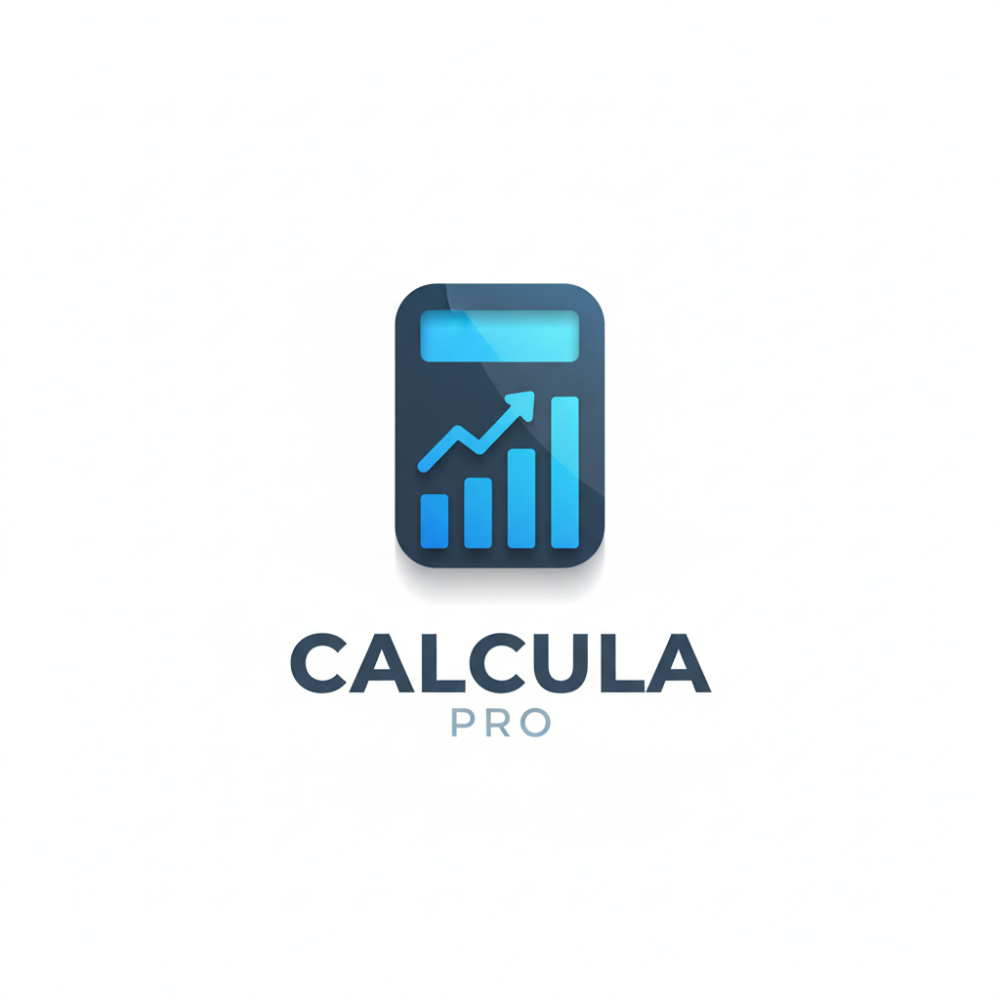
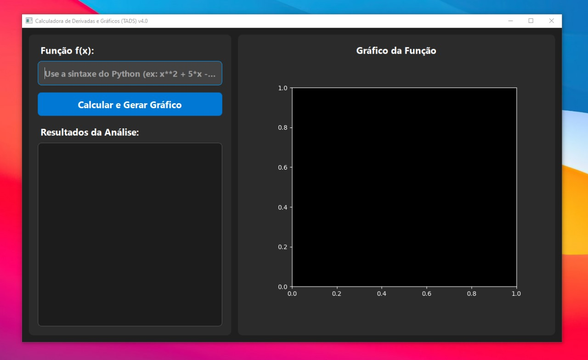
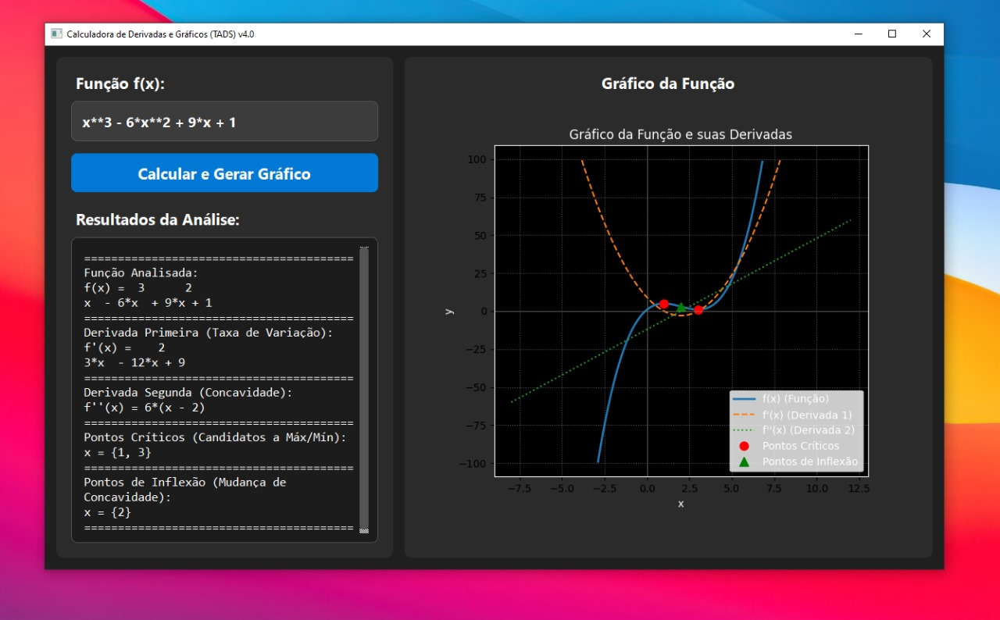

# **Aplicações Computacionais de Derivadas \- TADS**

Este repositório contém o código-fonte do trabalho da disciplina **MATEMÁTICA APLICADA II**, ministrada pela Professora Tásia do Vale. O projeto demonstra a aplicação de conceitos de cálculo diferencial (derivadas) para resolver problemas de otimização, análise de tendências e física, utilizando Python.

## **Grupo**

* Pedro Davi  
* Thiago Lima  
* Gustavo José

## **Descrição do Projeto**

O script Trabalho\_Derivadas\_TADS.py implementa a solução para 5 problemas propostos, que incluem:

1. **Otimização de Desempenho:** Encontrar o ponto de mínimo de uma função de custo de sistema.  
2. **Gradient Descent:** Implementar o algoritmo de Descida do Gradiente para minimizar uma função de custo, simulando o treinamento de um modelo de Machine Learning.  
3. **Análise de Tendências:** Encontrar o ponto de inflexão em uma curva de adoção de tecnologia (ponto de máxima velocidade de crescimento).  
4. **Caso Prático 1:** Maximização de área de um terreno com perímetro fixo.  
5. **Caso Prático 2:** Análise de movimento (velocidade e aceleração) de um robô.

## **Tecnologias Utilizadas**

* **Python 3**  
* **SymPy:** Para cálculos simbólicos (derivação analítica, solução de equações).  
* **NumPy:** Para cálculos numéricos (execução do Gradient Descent).  
* **Matplotlib:** Para a visualização dos gráficos de cada problema.

## **Prints do Programa .exe**

### Interface:

### Exemplo de função (com gráfico):

### **Link para download do programa acima .exe:**

https://drive.google.com/file/d/1TccD1Ww0uAuX1Tw6N8IqPbTKb9f37gCw/view?usp=sharing

## **Como Executar o Projeto via Terminal**

Para executar este projeto e visualizar os gráficos, siga os passos abaixo.

### **1\. Clonar o Repositório**

git clone https://github.com/pedrodavi120/derivadas-matematica 
cd seu-repositorio

### **2\. Criar um Ambiente Virtual (Recomendado)**

Isso isola as dependências do projeto do restante do seu sistema.

**Windows:**

python \-m venv venv  
.\\venv\\Scripts\\activate

**macOS / Linux:**

python3 \-m venv venv  
source venv/bin/activate

### **3\. Instalar as Dependências**

As bibliotecas necessárias estão listadas no arquivo requirements.txt. Para instalar todas de uma vez, execute:

pip install \-r requirements.txt

### **4\. Executar o Script**

Após instalar as dependências, execute o script Python principal. O script irá processar todos os 5 problemas e, ao final, exibirá 5 janelas gráficas (uma para cada problema).

python Trabalho\_Derivadas\_TADS.py

*Trabalho apresentado para a avaliação da II Unidade da disciplina de Matemática Aplicada II do curso de Análise e Desenvolvimento de Sistemas (TADS).*
